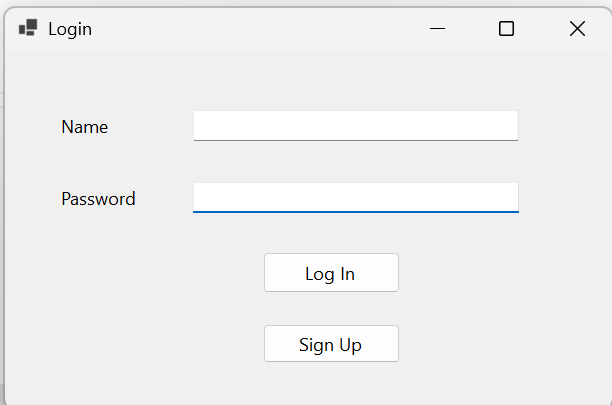
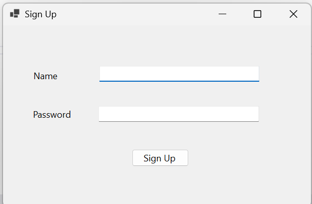
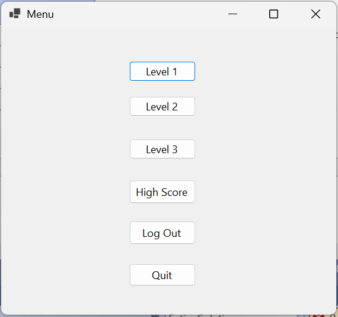
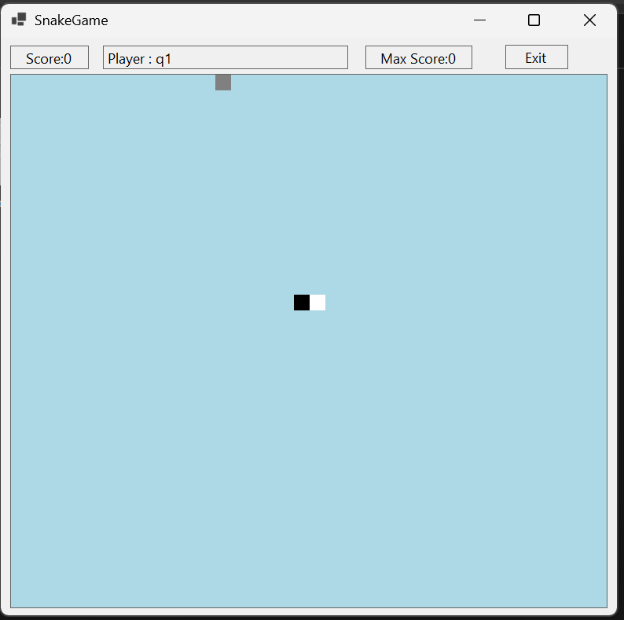
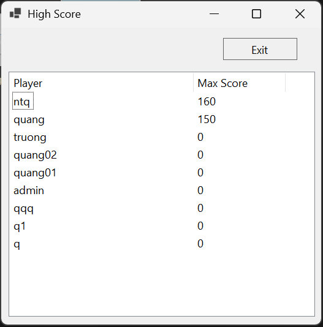

# Rebuild "SnakeXenzia" - C# WinForms

## 1. Overview
The famous game "SnakeXenzia" is rebuilt using C# programming language on WinForms platform. The project was implemented by Nguyen Thanh Quang (me), Mai Van Tuong, Doan Van Tu in December 2024.

## 2. Skills
- Object Oriented Programming (OOP)
  - Use the knowledge of inheritance, polymorphism, abstraction, and encapsulation of OOP to build the main objects of the game are the player and the snake. This approach not only helps to manage and organize the source code more effectively but also helps in developing applications that are easy to maintain and reuse.
- Data structures and algorithms (queues, lists, etc.)
  - Appropriate algorithms and data structures enable the snake to move flexibly and vividly.
- Asynchronous programming
  - Asynchronous programming (async, await) plays an important role in increasing and decreasing the speed of the snake's movement.  
- Interface built with C# WinForms  
- Store players's information using **SQL Server**
  - Connect between game and database with the support of Microsoft.Data.SqlClient library.
## 3. Features

### Sign up and login
 
 

### Menu and play 
 
 

### Highest score of players
 

# Trò chơi "Rắn săn mồi" - C# WinForms

## 1. Giới thiệu
Trò chơi "Rắn săn mồi" quen thuộc được xây dựng bằng ngôn ngữ lập trình **C#** trên nền tảng **WinForms**. Dự án được thực hiện bởi Nguyễn Thành Quang (tôi), Mai Văn Tưởng, Đoàn Văn Tú.

## 2. Kiến thức sử dụng
- Lập trình hướng đối tượng (OOP)
  - Sử dụng các kiến thức về kế thừa, đa hình, trừu tượng, đóng gói của OOP để xây dựng các đối tượng chính của game như người chơi, con rắn. Cách tiếp cận không chỉ giúp quản lý và tổ chức mã nguồn một cách hiệu quả hơn mà còn giúp trong việc phát triển các ứng dụng dễ bảo trì và tái sử dụng.
- Cấu trúc dữ liệu và giải thuật (hàng đợi, danh sách, v.v.)
  - Các thuật toán và cấu trúc dữ liệu phù hợp giúp con rắn có thể di chuyển một cách linh hoạt và sinh động.
- Lập trình bất đồng bộ
  - Lập trình bất đồng bộ (async, await) đóng vai trò quan trọng trong việc tăng giảm tốc độ di chuyển của con rắn.  
- Giao diện xây dựng bằng C# WinForms  
- Lưu trữ thông tin người chơi bằng **SQL Server**
  - Kết nối giữa game và cơ sở dữ liệu bằng sự hỗ trợ của thư viện Microsoft.Data.SqlClient
## 3. Tính năng và giao diện

### Đăng ký và đăng nhập
 
 

### Giao diện trò chơi
 
 

### Lưu điểm cao nhất của người chơi
 
